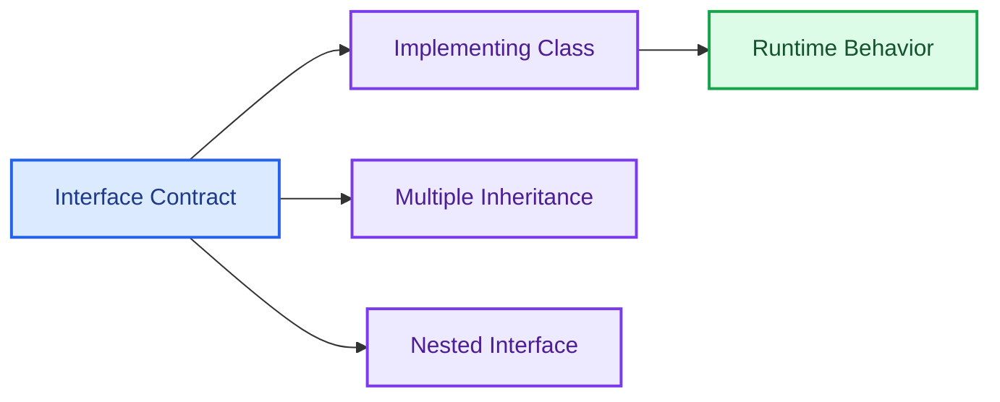

# Interfaces From Scratch in Java

<p align="center">
  
  
  
</p>

This repository explains Java interfaces from first principles. It includes examples for interface methods, fields, multiple inheritance through interfaces, nested interfaces, and implementation classes.

## What It Covers

- Basic interface declaration.
- Interface methods and implementation classes.
- Fields inside interfaces.
- Multiple inheritance using interfaces.
- Nested interface examples.
- Practical OOP relationship between contracts and concrete classes.

## Repository Map

```text
Bird.java, Eagle.java, Hen.java                    Basic interface examples
InterfaceMethod_Bird.java                          Interface method examples
Fields_In_Interface.java                           Interface field behavior
MultipleInheritance_*                              Multiple inheritance through interfaces
NestedInterface_Bird.java, NestedEagle*.java       Nested interface examples
Main.java                                          Entry point for examples
interface_docs                                     Supporting notes
```

## Concept Flow



## Run Locally

```powershell
javac *.java
java Main
```

## Revision Notes

- An interface defines what a class can do, not how it does it.
- Java supports multiple inheritance of type through interfaces.
- Interface fields are public, static, and final by default.
- Interfaces are central to dependency inversion and clean LLD.

## Interview Talking Points

```text
I use this repo to revise how interfaces support abstraction and dependency inversion.
The examples show why code should depend on contracts instead of concrete classes.
```
